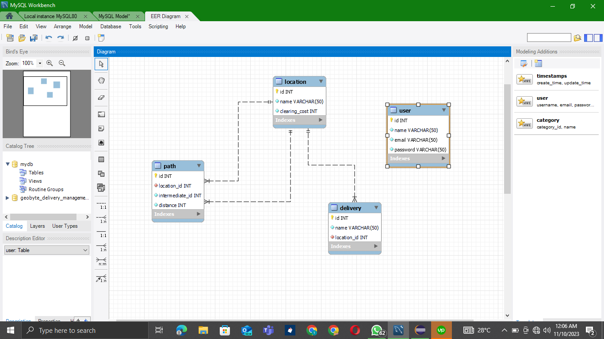

# GeoByte_Delivery_Management_System
A five (5) days Development Assessment from ByteWork

This repository contains the solutions to the five (5) days Assessment, which was addressed in two different ways:

## Solution1
This folder contains the first solution, addressed using Swing, JDBC and MySQL Tools as earlier mentioned in the <b>Issues</b> of this repository.

The majour principle used to address the problem is known as <b>Dijkstra Algorithm</b>.

This algorithm was implemented within the <b>Dijkstra class</b> (Dijkstra.java) file to help find the shortest paths in a directed graph of nodes(locations) submitted by the <b>WeightedGraph class</b> (WeightedGraph.java) file as constructed using the <b>WeightedEdge class</b> (WeightedEdge.java) file.

### Requirements:
To successfully run this Solution1 Project Folder, the tools listed are needed:
<ol>
  <li>
    MySQL Database Server 
  </li>
  <li>
    Eclipse Integrated Development Environment (IDE)
  </li>
  <li>
    MySQL JDBC Connector. <i>(this had been made available in the <b>ex_lib</b> folder within the Solution1)</i>
  </li>
</ol>

### How To Run The Solution1 Project Folder:
<ol>
<li>
Open any of the MySQL query editor available on your PC.
</li>
<li>
Copy and paste the set of SQL queries available inside the <strong> geobyte_delivery_management_system.sql</strong> file. <i>(the geobyte_delivery_management_system.sql file is also located inside the Solution1 Project Folder.)</i>
</li>
<li>
Run/execute the provided queries to create the needed database called <strong> geobyte_delivery_management_system</strong> with it respectful tables.
The Entity Relation Diagram (ERD) of the Schema should be like this:

</li>
<li>
Launch the Eclipse IDE
</li>
<li>Import the <b>Solution1</b> Project Folder into your Eclipse IDE.
</li>
<I>From the build paths of your Eclipse IDE,</I> add the provided MySQL JDBC Connector as an external jar file. <I>(to enable the program connect to the MySQL Database Server)</I>.
</li>
<li>
Finally, run the project by clicking on the <b>run</b> button within the IDE.
</li>
</ol>

The project is expected to run successfully, else revisit this execution procedures again.

### Note:
<ol>
  <li>
    You're expected to <b>register a new User</b> from the Application at first use.
  </li>
  <li>
    Likewise, minimum of five(5) new locations are to be added for better performance.
  </li>
  <li>
    Following the Assumption rules as provided, a minimum of three deliveries are to be added before generating the Optimum Route.
  </li>
</ol>